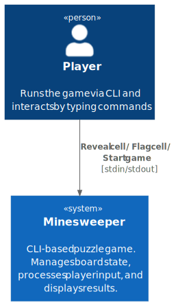

# Chapter 3: System Scope and Context

## 3.1 System Scope

Minesweeper is a self-contained CLI application. It has no external systems, databases, or network dependencies. The only actor is the human player interacting through a terminal.

## 3.2 Context Diagram (C4 Level 1)

Diagram source: `docs/architecture/diagrams/c4-context.puml`

## 3.3 External Interfaces

| Interface | Direction | Description                              |
|-----------|-----------|------------------------------------------|
| stdin     | In        | Player types commands (e.g. `r 2 3`, `f 1 4`). |
| stdout    | Out       | Game renders the board and status messages. |

There are no other external interfaces.
