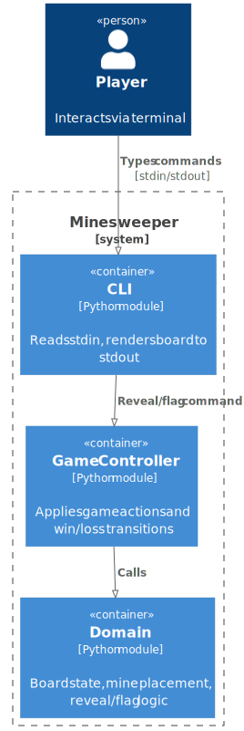
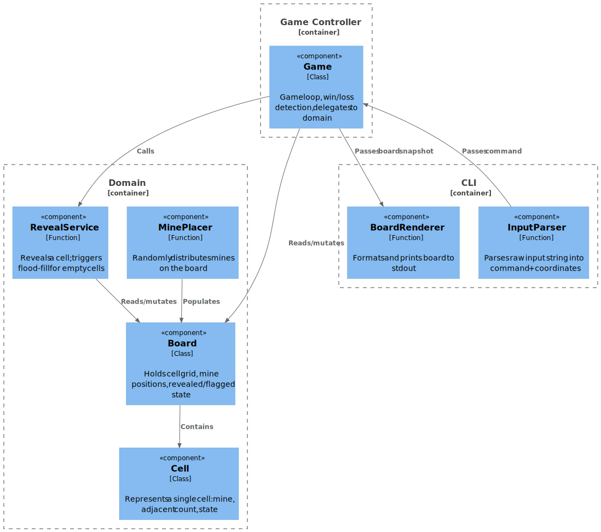

# Chapter 5: Building Block View

## 5.1 Level 1 — Container Diagram (C4)



Diagram source: `docs/architecture/diagrams/c4-container.puml`

### Container Responsibilities

| Container       | Module        | Responsibility                                      |
|-----------------|---------------|-----------------------------------------------------|
| CLI             | `cli.py`      | Parse stdin input, invoke controller, render output.|
| Game Controller | `game.py`     | Game loop, win/loss detection, command dispatch.    |
| Domain          | `board.py`, `cell.py` | Board state, mine placement, reveal/flag rules. |

---

## 5.2 Level 2 — Component Diagram (C4)



Diagram source: `docs/architecture/diagrams/c4-component.puml`

### Component Responsibilities

| Component     | Location        | Responsibility                                              |
|---------------|-----------------|-------------------------------------------------------------|
| Board         | `board.py`      | 2D grid of cells; exposes reveal/flag operations.           |
| Cell          | `cell.py`       | Data class: `is_mine`, `adjacent_count`, `revealed`, `flagged`. |
| MinePlacer    | `board.py`      | Randomly places mines and computes adjacent counts.         |
| RevealService | `board.py`      | Reveals a cell; recursively reveals neighbours if empty.    |
| Game          | `game.py`       | Runs the game loop; checks win/loss after each action.      |
| BoardRenderer | `cli.py`        | Renders the board grid and status line to stdout.           |
| InputParser   | `cli.py`        | Parses `"r 2 3"` / `"f 1 4"` into structured commands.     |

---

## 5.3 Module Structure

```
minesweeper/
├── cell.py       # Cell data class
├── board.py      # Board, MinePlacer, RevealService
├── game.py       # Game controller
└── cli.py        # InputParser, BoardRenderer, entry point
```
