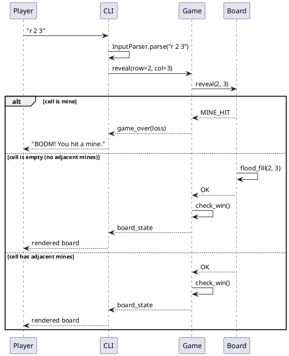
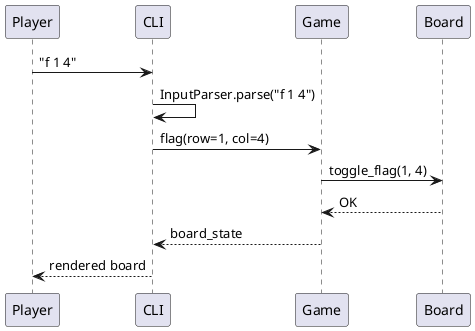
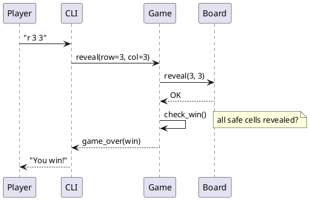

# Chapter 6: Runtime View

Three key scenarios are documented below.

---

## 6.1 Scenario: Reveal a Cell

Diagram source: `docs/architecture/diagrams/seq-reveal-cell.puml`

---

## 6.2 Scenario: Flag a Cell

Diagram source: `docs/architecture/diagrams/seq-flag-cell.puml`

---

## 6.3 Scenario: Win Condition

Diagram source: `docs/architecture/diagrams/seq-win.puml`

