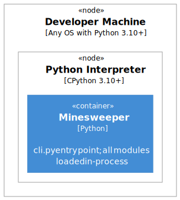

# Chapter 7: Deployment View

## 7.1 Overview

Minesweeper is a single-process CLI application. There is no server, container image, or cloud infrastructure. Deployment means running the script directly on any machine with Python 3.10+.

## 7.2 Deployment Diagram (C4 Level)



Diagram source: `docs/architecture/diagrams/deployment.puml`

## 7.3 How to Run

```bash
# From the project root
python minesweeper/cli.py
```

## 7.4 Runtime Requirements

| Requirement        | Value              |
|--------------------|--------------------|
| Python version     | 3.10+              |
| External packages  | None (stdlib only) |
| OS                 | Any (Linux, macOS, Windows) |
| Persistent storage | None               |
